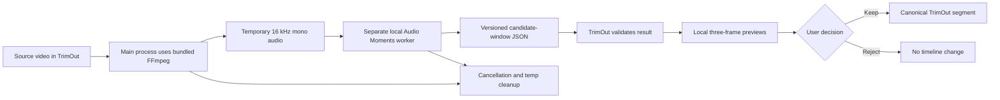

# TrimOut Audio Moments — Repository Audit

**Audit date:** 2026-07-18  
**TrimOut repository:** `D:\trimming soccer\player-clip-prep`  
**Audited commit:** `59b8680f` (`origin/master` at audit time)  
**Feature branch:** `feature/audio-moment-discovery-v1`  
**Application version:** `1.2.0`

## 1. Scope and repository boundaries

This audit was completed before changing production code.

TrimOut is the public GPL-2.0 desktop application. It remains responsible for local media loading, playback, clip selection, segment state, export, local preview generation, and the user-facing entry point for Audio Moments.

The Audio Moments analysis engine is not part of the public TrimOut repository. Its model code, evaluation code, inference pipeline, processing rules, and future commercial infrastructure belong in a separate private worker repository. The current phase is local-only: no Railway, KICKO backend, billing, RunPod, cloud upload, or production integration is in scope.

KICKO is audited only as an existing regression boundary. Existing KICKO TypeScript failures and handoff code are not Audio Moments work and must not be changed unless they directly prevent Audio Moments from running.

At audit time:

- The TrimOut tracked tree matched `origin/master` before this document was added.
- The user had three unrelated untracked items: `Create-Desktop-Shortcut.ps1`, `TrimOut-Launcher.bat`, and `dist-release/`. They are outside this feature and must remain untouched.
- No separate Audio Moments worker repository existed yet.
- The specification pack is not a Git repository. It contains the specification, instructions, fixture templates, and the two local test videos.

## 2. Current product and user flow

TrimOut is an Electron, React, and TypeScript application optimized for local football clip preparation.

The current flow is:

1. Launch TrimOut and open or drag in a local video, or download a supported media URL.
2. Optionally create or open a multi-game `.trimout` project.
3. Seek through the source video locally.
4. Use QuickCut to create a time range from the current playhead.
5. Select a football action manually in `ActionPickerModal`.
6. Review and play the resulting segments in `ClipsPanel`.
7. Finish by exporting clips locally or, optionally, reviewing selected exported clips before a KICKO handoff.

Local editing is currently free and works without a KICKO subscription. KICKO authorization, entitlement checks, and clip upload are optional downstream behavior. Audio Moments must preserve that independence: an unavailable local worker must not prevent opening, trimming, organizing, or exporting media.

## 3. Technology and dependency baseline

`package.json` defines:

- Node used for this audit: `v22.13.1`
- Yarn: `4.11.0`
- Electron: `43.1.0`
- React: `18.3.x`
- TypeScript: `5.9.x`
- electron-vite: `5.0.x`
- Zod: `4.3.x`
- FFmpeg/FFprobe bundled as application resources
- Vitest: `4.0.x`

The current public repository no longer contains the earlier Whisper UI or the `@xenova/transformers` dependency. The technical specification references `src/main/whisper.ts` and `TranscriptPanel.tsx`, but those files are absent at audited commit `59b8680f`. Server/local-worker ASR must therefore be implemented only in the private worker with `faster-whisper`; it must not restore a heavy model dependency to the Electron package.

The full repository verification entry point is `yarn check`, which expands to TypeScript, lint, unit tests, production build, license checks, i18n scanning, dependency dedupe, and documentation generation.

## 4. Baseline verification results

All results below were captured before Audio Moments production code was added.

| Command | Result | Existing baseline detail |
|---|---:|---|
| `yarn tsc` | Failed | 45 existing TypeScript errors. Most are in `src/renderer/src/kickoBridge.ts`; other errors are in `kickoBridge.test.ts`, `src/main/index.ts`, `src/main/kickoHandoffTransport.ts`, `BottomBar.tsx`, and `Timeline.tsx`. |
| `yarn lint` | Failed | 27,935 problems: 27,931 errors and 4 warnings. The dominant cause is repository-wide CRLF content against the LF-only lint rule. |
| Lint with `linebreak-style` disabled | Failed | 89 existing errors and 4 warnings remain. These cover pre-existing formatting, unused variables, import rules, and accessibility rules. |
| `yarn test run` | Passed | 24 test files and 133 tests passed. |
| `yarn build` | Passed | Main, preload, and renderer production bundles built successfully. Sass emitted an existing `@import` deprecation warning. |
| `yarn check-licenses` | Failed | The script invokes `node script/checkLicenses.ts`; Node 22 rejected the `.ts` extension before the license check ran. |
| `yarn dedupe --check` | Failed | Three dependency resolutions can be deduplicated: `@types/node`, `vite`, and `esbuild`. |
| `yarn check` | Failed | It stops at the existing `yarn tsc` failure. |

The 45 TypeScript errors break down as follows:

| Count | Code and file |
|---:|---|
| 17 | `TS4111` in `src/renderer/src/kickoBridge.ts` |
| 9 | `TS2379` in `src/renderer/src/kickoBridge.ts` |
| 6 | `TS2339` in `src/renderer/src/kickoBridge.ts` |
| 4 | `TS6133` in `src/renderer/src/Timeline.tsx` |
| 3 | `TS2379`/`TS4111` in `src/renderer/src/kickoBridge.test.ts` |
| 2 | `TS6133` in `src/renderer/src/BottomBar.tsx` |
| 1 each | `TS18047` and `TS2742` in `src/main/index.ts` |
| 1 | `TS2304` in `src/main/kickoHandoffTransport.ts` |
| 1 | `TS2322` in `src/renderer/src/kickoBridge.ts` |

These failures are baseline, not Audio Moments regressions. This feature must not perform a broad CRLF/LF rewrite or repair unrelated KICKO errors. Audio Moments tests and type checks should be runnable independently so new failures remain distinguishable from this baseline.

## 5. Existing FFmpeg patterns

The canonical FFmpeg implementation is `src/main/ffmpeg.ts`.

Useful existing behavior:

- `getFfmpegPath` and the internal path resolver locate packaged or development binaries.
- `runFfmpegProcess` tracks running processes with `AbortController` instances.
- `abortFfmpegs` cancels active FFmpeg processes.
- `runFfmpegWithProgress` parses FFmpeg progress and supports a progress callback.
- `captureFrameToFile`, `captureFrameToClipboard`, and `captureFrames` already implement local frame extraction.
- `src/renderer/src/ffmpeg.ts` is the renderer-facing wrapper for the legacy remote FFmpeg API.
- `useFrameCapture.ts` owns renderer-side capture orchestration and output naming.

`src/main/aiAnalysis.ts` contains `detectSpeechSegments`, `detectEnergyPeaks`, and `detectSceneChanges`. Its `detectEnergyPeaks` function is not a true adaptive energy detector; it simply calls `silencedetect` at a louder fixed threshold and returns non-silent ranges. It also duplicates FFmpeg path resolution and does not use the canonical cancellation/progress runner. It is suitable only as an evaluation baseline and should not become the production Audio Moments pipeline.

The renderer does not currently call `detectSpeechSegments` or `detectEnergyPeaks`. They are exposed through the main-process RPC but have no active product UI.

## 6. IPC, progress, cancellation, and error patterns

The preload creates a typed `window.electron` proxy. Calls are routed through `ipcRenderer.invoke('__electron_rpc__', method, args)` to a main-process `remoteApi` object.

The main process validates that RPC requests came from the active trusted renderer. Navigation, popups, permissions, and webviews are restricted. However, the inherited renderer still uses `nodeIntegration: true`, `contextIsolation: false`, and `@electron/remote`. Audio Moments must therefore keep worker access and filesystem operations in the main process and expose only a narrow typed API to the renderer.

Existing progress and cancellation patterns include:

- `useLoading.ts`: a shared working state, `AbortController`, and the global cancel action.
- `abortFfmpegs`: process-level FFmpeg cancellation.
- `parseFfmpegProgressLine`: progress extraction, including audio-only FFmpeg output.
- KICKO's main-process upload transport: streaming, operation IDs, cancellation, and cleanup. This is a regression reference only; it is not to be modified or reused for backend work in the current local phase.

Audio Moments should follow the same user-visible lifecycle vocabulary—start, progress, cancel, error, retry—without copying KICKO business or entitlement logic.

## 7. Segment integration point

The canonical segment state is owned by `useSegments.tsx`.

- `SegmentBase` provides `start`, optional `end`, and optional `name`.
- `StateSegment` adds an ID, color index, selection state, and optional football metadata.
- `loadCutSegments` converts external segment-shaped input into canonical TrimOut state, supports append or replace, and clamps times to the media duration.
- `addClip` creates one explicit start/end range and attaches manual football metadata.
- `ClipsPanel` is the primary visible list for current segments.

The exact Audio Moments integration rule is:

- Candidate windows remain separate pending review state.
- Receiving analysis results must not call `loadCutSegments` for all candidates.
- `Keep` adds only the chosen candidate to canonical TrimOut segment state.
- `Reject` creates no segment and does not alter export state.
- No candidate receives an exact sports-event label from the analysis pipeline.

## 8. Local preview integration point

Three preview frames can be generated with existing FFmpeg capture primitives. They must be generated locally from the original video at candidate-relative timestamps and must never be sent to a model or worker. Preview generation must not mutate the original media or create timeline segments.

## 9. Storage and caching patterns

TrimOut uses `electron-store` for configuration and stores data under Electron `userData` unless a portable configuration path is selected. API keys use Electron `safeStorage`; KICKO handoff sessions are encrypted and expiry-checked.

There is no existing Audio Moments result cache. A local cache must be isolated under an Audio Moments-specific `userData` directory and keyed by source hash plus analysis options and model/pipeline versions. It must not store signed URLs, full source paths in feedback, or any private worker secret.

## 10. Current test media

The two user-provided files are outside the public TrimOut repository:

| Intended mode | File | Duration | Video | Audio |
|---|---|---:|---|---|
| `commentary` | `Brazil vs. Egypt  Full Game Highlights  ESPN FC.mkv` | 1,496.468 s (24:56.468) | H.264, 1920×1080, 25 fps | Opus stereo, 48 kHz |
| `sideline` | `ONE CUP FINAL -  U12 PRE MLS ONE FC vs U12 PRE MLS ORLANDO ACADEMY SA - 20260111.mkv` | 2,275.668 s (37:55.668) | H.264, 1920×1080, 29.97 fps | Opus stereo, 48 kHz |

These files are sufficient to build and exercise the local harness and to generate initial candidate timestamps. They are not committed or copied into the public repository. Human-approved ground truth does not exist yet; the worker will first produce review candidates that the user can approve or reject, after which `ground_truth.csv` can be generated.

## 11. Local Audio Moments flow after audit

The approved local-only integration boundary is:

No full video is sent to the worker. The local worker receives only the extracted audio file. The original source remains unchanged.

## 12. Expected file changes

Names may be adjusted to match implementation details, but responsibility must remain separated.

Public TrimOut repository:

- `src/common/audioMoments.ts` — public request/result contracts and Zod validation.
- `src/main/audioMomentExtraction.ts` — bundled-FFmpeg audio extraction and cleanup.
- `src/main/audioMomentClient.ts` — local worker client only in the current phase.
- `src/main/audioMomentCache.ts` — local versioned result cache.
- `src/renderer/src/hooks/useMatchMoments.ts` — UI orchestration without secrets or model logic.
- `src/renderer/src/components/MatchMomentsPanel.tsx` — mode selection, progress, and candidate review.
- `src/renderer/src/components/MomentCandidateCard.tsx` — local previews and Keep/Reject controls.
- Focused tests for contracts, invalid results, cancellation, cleanup, Keep, Reject, and regression isolation.

Separate private worker repository:

- Python analysis core and contracts.
- Evaluation harness and metrics.
- Energy-only baseline.
- YAMNet adapter.
- One low-complexity EfficientSED or PretrainedSED adapter for benchmarking.
- `faster-whisper` adapter for mode-specific ASR when introduced.
- CLI and local API adapters calling the same core function.
- Worker-only tests, fixture manifest, reports, and verification command.

No worker model, inference implementation, phrase dictionary, scoring weights, proprietary processing logic, deployment secret, or commercial rule belongs in the public TrimOut repository.

## 13. Regression boundaries

Audio Moments work must preserve:

- Opening and editing local media without the worker.
- Existing QuickCut and manual action selection.
- Canonical segment creation and export.
- FFmpeg packaging and source/license compliance.
- Project save/load behavior.
- KICKO handoff behavior and its current tests.
- Free local editing and existing optional KICKO entitlement behavior.
- Original source media immutability.

The pre-existing TypeScript, lint, license-script, and dedupe failures documented above are not acceptance failures introduced by Audio Moments. New feature-specific checks must pass independently, and the existing passing unit tests and production build must remain passing.

## 14. Audit conclusion

The repository contains all required local integration primitives: bundled FFmpeg, process cancellation, progress parsing, typed main-process RPC, local frame capture, canonical segment loading, clip review, export, local storage, and tests.

The specification's Whisper and transcript references are stale for the audited public commit and must not drive Electron dependencies. The correct next step is a separate private local worker with an evaluation harness, followed by audio-only extraction and candidate generation from the two supplied videos. KICKO, backend, billing, Railway, and RunPod remain out of scope.
